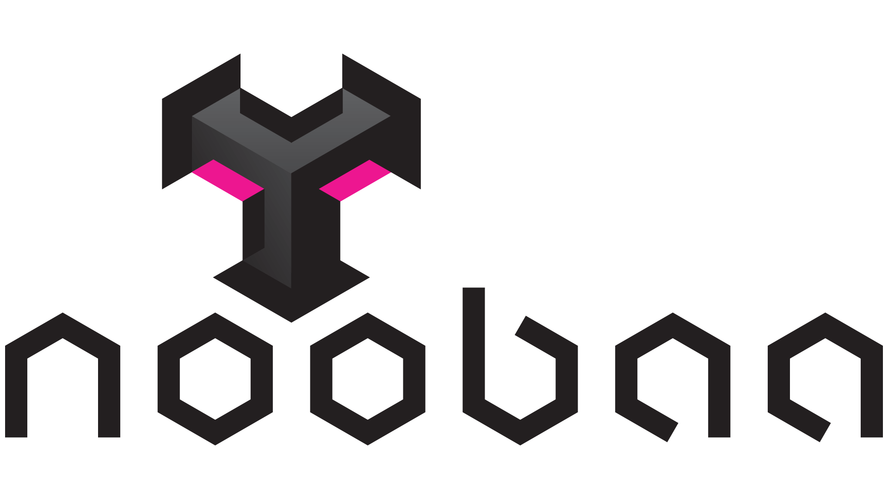

<link rel="shortcut icon" type="image/x-icon" href="noobaa_icon.png">

# NooBaa Docs

NooBaa is a highly customizable and dynamic data gateway for objects, providing data services such as caching, tiering, mirroring, dedup, encryption, compression,  over any storage resource including S3, GCS, Azure Blob, Filesystems, etc. The goal is to simplify data flows for admins by connecting to any of the storage silos from private or public clouds, and providing a single scalable data services, using the same S3 API and management tools. NooBaa allows full control over data placement with dynamic policies per bucket or account.

**⚠️ THE FOLLOWING IS WORK IN PROGRESS**
Please refer to the current docs location in [noobaa-core wiki](https://github.com/noobaa/noobaa-core/wiki) and [noobaa-operator](https://github.com/noobaa/noobaa-operator/tree/master/doc) repos.

## Getting Started

- [Getting started with noobaa-operator CLI](noobaa-operator-cli.md) 
- [Getting started with noobaa-core standalone](noobaa-core-cli.md)
- [Getting started with noobaa-core nsfs gateway](noobaa-core-nsfs.md)

## User Guide

- [noobaa install](noobaa-install.md) - Installing the operator and system on kubernetes
- [noobaa status](noobaa-status.md) - Checking the operator and system status
- [Using the s3 service](noobaa-s3-service.md)

- Configuring classes using the operator:
  - [BucketClass](noobaa-bucket-class.md) - Configure policies to apply to a class of buckets.
  - [BackingStore](noobaa-backing-store.md) - Configure cloud or pv storage used in classes as a chunk-storage - aka "data-shredder".
  - [NamespaceStore](noobaa-namespace-store.md) - Configure cloud or pv storage used in classes for transparent data access.

- Creating buckets using the operator:
  - [OBC](noobaa-obc.md) - Create buckets and access with ObjectBucketClaims
  - [COSI](noobaa-cosi.md) - Create buckets and access with Kubernetes-COSI (pre-alpha)

## Advanced Documentation

- [NooBaa CRD](noobaa-crd.md) - The basic CRD to deploy a NooBaa system.
- [Using the mgmt service](noobaa-mgmt-service.md)
- [S3 compatibility](noobaa-s3-compat.md)
- [Setup routes, SSL, certificates, etc]()
- [Scaling, resource tuning, sizing, etc]()
- [Troubleshooting]()
- [Monitoring]()
- [Running on minikube]()
- [Running on kind]()
- [Running on Openshift]()

## Videos

- [Youtube Presentations](https://www.youtube.com/playlist?list=PLsawh7cxjeFC1d7eae5hXlRl9QS0G-H2N)
- [Youtube Demos](https://www.youtube.com/playlist?list=PLsawh7cxjeFAmFE9_oLg-DYkEaZTi_ZaF)

## Communicate

- [Github - Issues](https://github.com/noobaa/noobaa-core/issues)
- [Slack - join the channel](https://www.noobaa.io/community)
- [Github - post a discussion (new)](https://github.com/noobaa/noobaa-core/discussions)
- [Email - post to google group (new)](https://groups.google.com/g/noobaa)
- [Public Calendar](https://calendar.google.com/calendar/u/1?cid=aGFvbmJiMWszb2dib2phbXIxa2YwdGpldWdAZ3JvdXAuY2FsZW5kYXIuZ29vZ2xlLmNvbQ) - use to follow the meetings schedule
- [Meeting doc](https://docs.google.com/document/d/1VgiNOuLW92KcuJ0sGnXRVfT9oeImwbzbpEb4QkCEvDY/edit?usp=sharing)
- [Youtube recordings](https://www.youtube.com/playlist?list=PLsawh7cxjeFDiUsuOGncF_KZImQCgj5U-) - watch the meetings you missed

## Developers

- [How to Contribute](/CONTRIBUTING.md)
- [Developers Guide](https://github.com/noobaa/noobaa-core/wiki/Developers-Guide)
- [Git Pull Request Guide](https://github.com/noobaa/noobaa-core/wiki/Git-Pull-Request-Guide)

## License

Apache License 2.0, see [LICENSE](/LICENSE)

---

